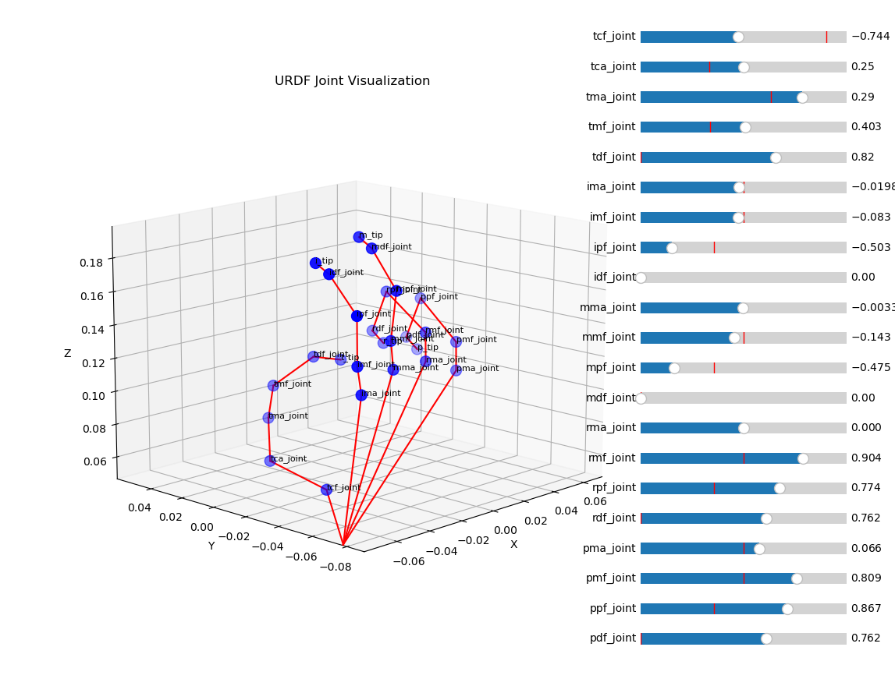

# URDF RoM Visualizer

A quick python script to visualize the workspace and range of motion of your urdf. No mesh is used.

Also prints out the kinematic tree of the urdf.

<!--  -->

## Quickstart

    python3 rom_visualizer.py [your_urdf.urdf] --sample=[sample_size_per_joint]

Currently doens't work well with deep trees and too many branches due to configuration explosion. Please let me know if you have a good solution to that.